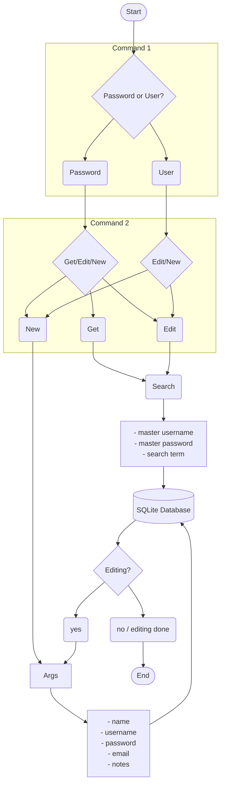

# Flowchart

Above is a flowchart to show describe the functionality of the program. The first command provided is either `password` or `user`. The second command may be, `new`, `edit`, or `get`. After that, the arguments will vary. 
- Passwords 
	1. Create a new password: provide their current `master username` and `master password` , along with any other arguments such as `email`, `username`, etc. 
	2. Edit a password: provide the aforementioned master credentials to select the desired password from the database, and provide new data to overwrite the existing data.
	3. View a password: input their user credentials as well as the password name they wish to view.
	4. TODO: list passwords
- Users
	1. Create a user: provide a master username and password.
	2. Edit a user: Provide the master credentials for the desired user, and update data.
	3. It is important to note that users and their credentials cannot be viewed as it would provide users access to other users' data.